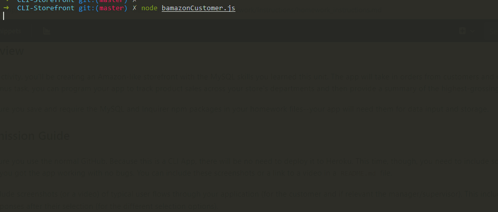
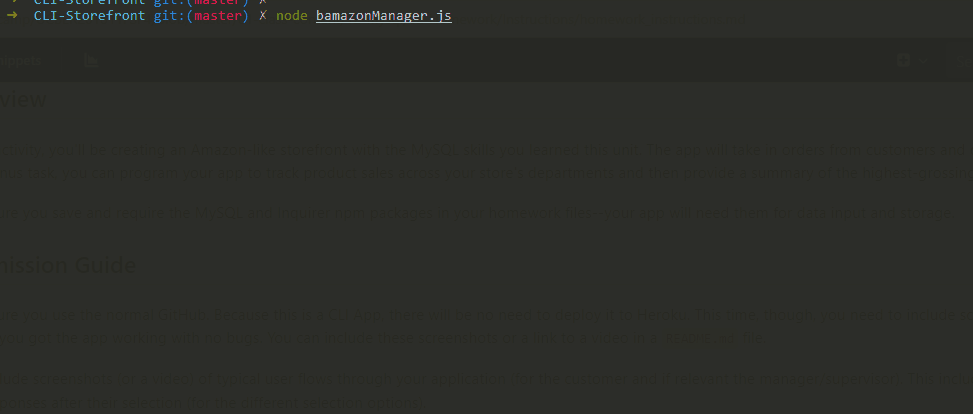
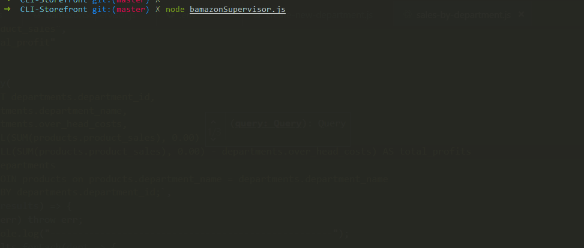

# CLI-Storefront
Command line storefront simulator using MySQL and Node. 

## Installation
* Clone this repository  
* Run `create-store.sql` in your SQL workspace.
* Run `npm install` in your terminal to install dependencies.  

## Customer
Using `node bamazonCustomer.js` in the CLI simulates a storefront where a user will be able to purchase an item from a provided list based on the item id and then choose how many of that item they will purchase. The result is an adjustment to the database and a notification to the customer how much the purchase cost.

## Manager
Using `node bamazonManager.js` in the CLI allows some higher level inventory management and lets the user see stock and sales of products in the inventory. They are also able to add new products and restock inventory.

## Supervisor
Using `node bamazonSupervisor.js` in the CLI provides the highest level of control over the operation. The user can see sales by each department, overhead costs, and department profits. They are also able to create a brand new department by name and predicted overhead costs.

